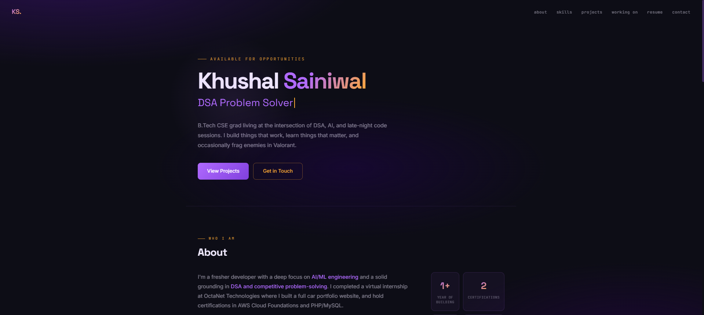
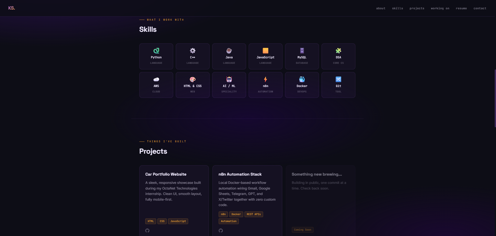

# 🚀 Developer Portfolio

A modern, responsive, and interactive developer portfolio built with **React**, **Vite**, and **Tailwind CSS**. The website showcases my projects, technical skills, experience, and provides a fully functional contact form powered by **EmailJS**.

## 🌐 Live Demo

**Website:** [KS. - Portfolio](https://ks-portfolio-seven.vercel.app/)

---

## 📸 Preview




---

## ✨ Features

- 🎨 Modern and responsive UI
- ⚡ Built with React + Vite
- 📱 Mobile-first design
- 🌙 Smooth animations and transitions
- 📂 Project showcase section
- 🛠 Skills & Technologies section
- 👤 About Me section
- 📄 Downloadable Resume
- 📬 Fully functional contact form using EmailJS
- 📧 Automatic confirmation email to visitors
- 🔗 Social media links
- 🚀 Optimized for performance

---

## 🛠 Tech Stack

### Frontend

- React
- Vite
- JavaScript (ES6+)
- Tailwind CSS

### Services

- EmailJS

### Deployment

- Vercel

---

## 📁 Project Structure

```
portfolio/
├── public/
├── src/
│   ├── assets/
│   ├── components/
│   ├── constants/
│   ├── hooks/
│   ├── pages/
│   ├── App.jsx
│   └── main.jsx
├── .env
├── package.json
└── README.md
```

---

## ⚙️ Installation

Clone the repository.

```bash
git clone https://github.com/Khushal-05/portfolio.git
```

Navigate to the project.

```bash
cd portfolio
```

Install dependencies.

```bash
npm install
```

Start the development server.

```bash
npm run dev
```

---

## 🔑 Environment Variables

Create a `.env` file in the root directory.

```env
VITE_EMAILJS_SERVICE_ID=your_service_id
VITE_EMAILJS_TEMPLATE_ID=your_template_id
VITE_EMAILJS_PUBLIC_KEY=your_public_key
```

---

## 📬 EmailJS Setup

The contact form is powered by **EmailJS**.

Configure:

- Email Service
- Contact Notification Template
- Auto Reply Template

The application sends:

- 📩 A notification email to me
- ✅ An automatic confirmation email to the visitor

---

## 🚀 Build

```bash
npm run build
```

Preview production build.

```bash
npm run preview
```

---

## 📌 Future Improvements

- Blog section
- Dark/Light theme toggle
- Project filtering
- Visitor analytics
- Internationalization (i18n)
- CMS integration
- Admin dashboard
- Backend API integration

---

## 👨‍💻 About Me

I'm **Khushal Sainiwal**, a Computer Science graduate passionate about **Software Development**, **Artificial Intelligence**, **Machine Learning**, and **Full-Stack Development**.

I'm always eager to learn new technologies and build impactful software solutions.

---

## 🤝 Connect With Me

- 🌐 Portfolio: https://ks-portfolio-seven.vercel.app/
- 💼 LinkedIn: https://www.linkedin.com/in/khushal-sainiwal/
- 🐙 GitHub: https://github.com/Khushal-05
- 📧 Email: ksainiwal05@gmail.com

---

## 📄 License

This project is licensed under the MIT License.

---

⭐ If you like this project, consider giving it a star on GitHub!
